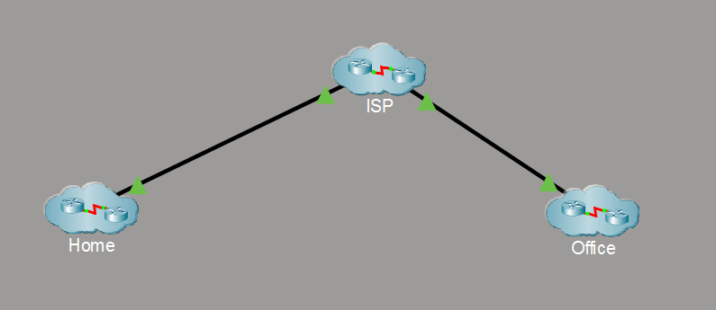
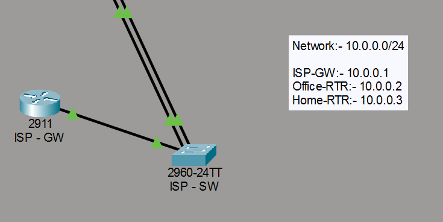
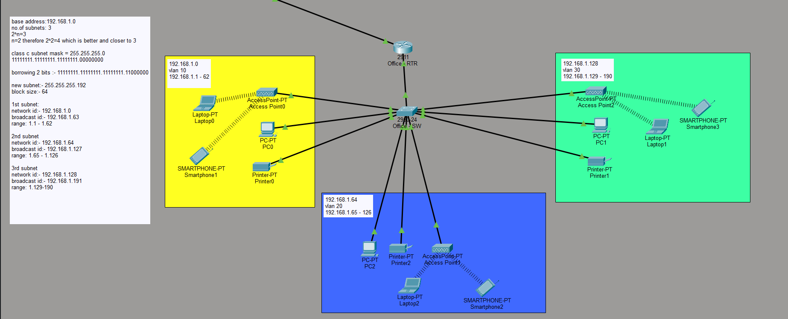
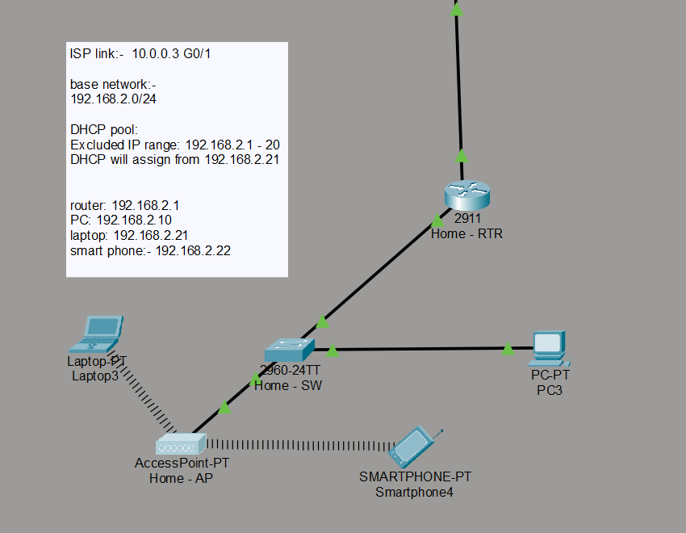

# Enterprise-Network-Design-using-Cisco-Packet-Tracer
Enterprise network design project built in Cisco Packet Tracer, featuring VLANs, inter-VLAN routing, DHCP, wireless networking, and ISP connectivity with planned expansion to enterprise services and security.

## Project Overview

This project demonstrates the design and implementation of a small enterprise network using Cisco Packet Tracer. 
The network consists of three logical segments:

- Corporate Office
- Home Network
- Internet Service Provider (ISP)

The Office network implements VLAN segmentation, inter-VLAN routing, DHCP services, and a hierarchical switching architecture. 
The Home network provides wired and wireless connectivity with DHCP services, while the ISP network simulates external 
connectivity between customer networks.

The project is being developed incrementally to simulate a real-world enterprise deployment. Future versions 
will include NAT/PAT, DNS, Web, Email, FTP, ACLs, SSH, OSPF, and additional enterprise services.

## Objectives

- Design a scalable enterprise network.
- Implement VLAN segmentation for different departments.
- Configure Router-on-a-Stick for inter-VLAN routing.
- Provide automatic IP address allocation using DHCP.
- Build a home network with wired and wireless connectivity.
- Simulate ISP connectivity.
- Follow structured network documentation and configuration practices.

## Network Topology


**ISP** ⬇️

**Office** ⬇️

**Home** ⬇️


## Network Architecture

The project is divided into three logical network segments:

### Office Network

- Department-based VLANs
- Router-on-a-Stick
- DHCP
- Managed switches

### Home Network

- Wired LAN
- Wireless LAN
- DHCP
- Access Point

### ISP Network

- ISP Gateway Router
- ISP Switch
- External connectivity simulation

## Technologies Used

| Technology                | Purpose                   |
|------------               |---------                  |
| Cisco Packet Tracer       | Network Simulation        |
| Cisco 2911 Router         | Routing                   |
| Cisco 2960 Switch         | Layer 2 Switching         |
| VLANs                     | Network Segmentation      |
| Router-on-a-Stick         | Inter-VLAN Routing        |
| DHCP                      | Automatic IP Assignment   |
| Wireless LAN              | Home Wi-Fi Connectivity   |
| Static Routing            | ISP Connectivity          |

## Features Implemented

- VLAN Segmentation
- Inter-VLAN Routing
- Router-on-a-Stick
- DHCP
- Home Wireless Network
- ISP Connectivity
- Modular Network Design

## Project Structure

```
Enterprise-Network-Design
│
├── PacketTracer
├── Images
├── Documentation
├── Configurations
└── README.md
```

## How to Use

1. Install Cisco Packet Tracer 8.2 or later.
2. Clone this repository.
3. Open the PacketTracer/Enterprise-Network-Design.pkt file.
4. Explore the topology and configurations.
5. Refer to the Documentation folder for implementation details.

## Verification & Testing

The following functionality has been verified:

- Successful inter-VLAN communication
- DHCP address assignment
- Wireless client connectivity
- ISP gateway connectivity

## Future Improvements

- [ ] NAT/PAT
- [ ] DNS Server
- [ ] Web Server
- [ ] FTP Server
- [ ] Email Server
- [ ] ACL Implementation
- [ ] SSH Management
- [ ] OSPF Routing
- [ ] Syslog
- [ ] NTP
- [ ] SNMP

## Author

**Vineeth S Poojary**

Cybersecurity Enthusiast

GitHub: https://github.com/VP13104

LinkedIn: https://www.linkedin.com/in/vineethspoojary